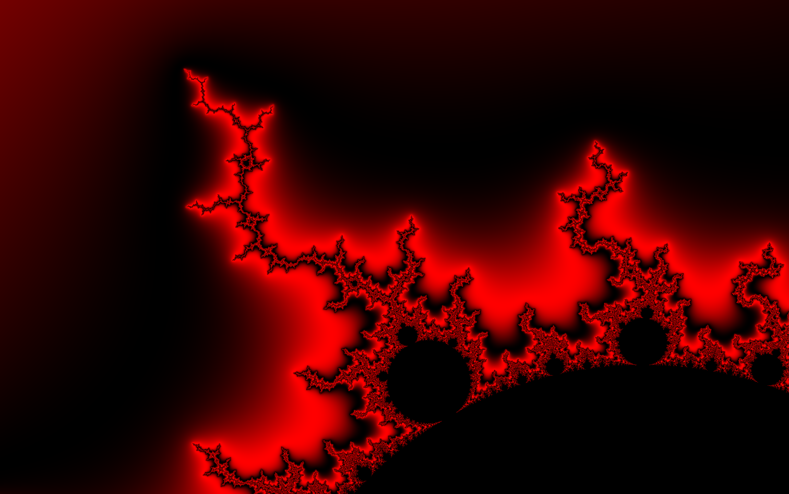
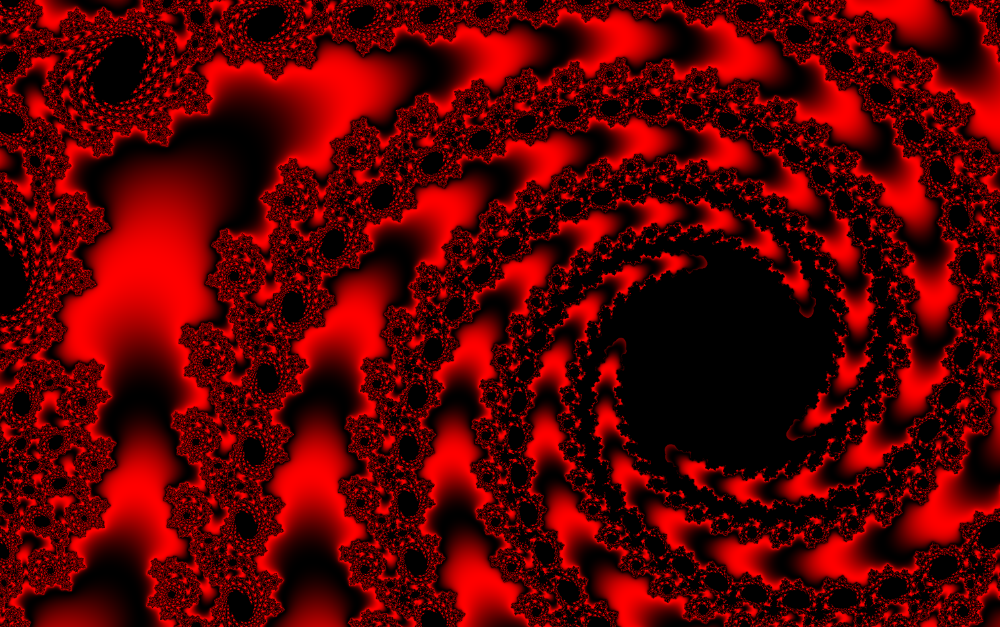
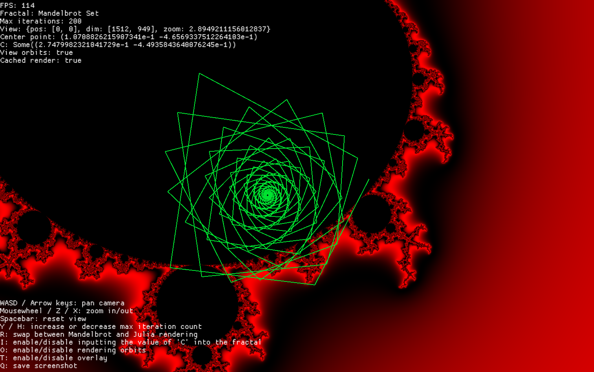

# Fractal Renderer Using Rust + Macroquad

Real-time GPU-accelerated fractal renderer built in Rust using Macroquad. Supports Mandelbrot, Julia, and Burning Ship fractal rendering implemented in GLSL fragment shaders.

| Mandelbrot Set | Julia Set | Orbit Rendering |
| -------------- | --------- | --------------- |
|  |  |  |

## Features

- Fractal rendering entirely on the GPU using custom fragment shaders
- Supports Mandelbrot, Julia, Burning Ship fractals
- Image smoothing using GPU-accelerated 4x supersampling
- Smooth panning and zooming using a custom screen-to-complex plane view manager
- Interactive orbit visualization
- Render caching only re-renders the image when the view changes
- Trait-based architecture for swapping fractals at runtime

## Running

```sh
cargo run --release
```

## Controls

- `WASD / Arrow keys`: pan camera
- `Mousewheel / Z / X`: zoom in/out
- `Spacebar`: reset view
- `Y / H`: increase or decrease max iteration count
- `R`: swap between Mandelbrot and Julia rendering
- `I`: enable/disable inputting the value of 'C' into the fractal (useful for Julia set rendering)
- `O`: enable/disable rendering orbits
- `T`: enable/disable overlay
- `Q`: save screenshot

## Roadmap

- [ ] Unlimited zoom (currently limited by GPU single-precision 32-bit floats)
- [ ] Improved coloring
- [ ] Shading
- [ ] WASM optimizations (remove rfd)
- [ ] Runtime custom fractals and function parsing
